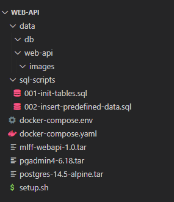
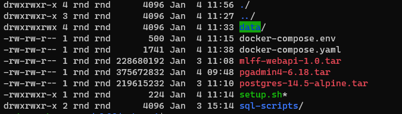
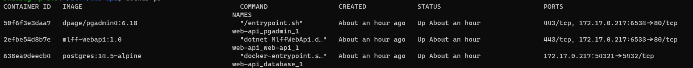

# Table of Content

1. For System Engineer
   1. [Configuration](#Configuration)
   2. [Deployment](#Deployment)
2. For Developers
   1. [Backend](ForDeveloper.md)
   2. [Frontend](FrontendIntegration.md)

## Configuration

- Use environment variable to configure the container. Set the variables in [docker-compose.env](./docker-compose.env)
- Environment options

| Variables                    | Descriptions                                                                                                                                                                                                                                                                                           | Required    | Default <br/> Value |
| :--------------------------- | ------------------------------------------------------------------------------------------------------------------------------------------------------------------------------------------------------------------------------------------------------------------------------------------------------ | ----------- | ------------------- |
| `ENABLE_SWAGGER_UI`          | To enable swagger documentation UI at `/swagger`                                                                                                                                                                                                                                                       | False       | true                |
| `USE_HTTPS_REDIRECTION`      | To enable https. This required certificate.                                                                                                                                                                                                                                                            | False       | true                |
| `USE_AZURE_SIGNAL_R_SERVICE` | To configure the application to use Azure SignalR service                                                                                                                                                                                                                                              | False       | false               |
| `IMAGE_OUTPUT_DIRECTORY`     | To set the output directory of the ANPR images. Make sure this directory is mounted to host to prevent images gone when container is brought down.                                                                                                                                                     | True        | `NULL`              |
| `DB_CONNECTION_STRING`       | To set the database connection string.<br/>Set the value to `Host=database;Database=mlff;Username=[username];Password=[password]` if using docker-compose. The values is depends on the database instances.<br/><br/>Refer to the postgres configuration in [docker-compose.env](./docker-compose.env) | True        | `NULL`              |
| `SIGNALR_CONNECTION_STRING`  | To set the signalR URL of Azure                                                                                                                                                                                                                                                                        | Conditional | `NULL`              |

## Deployment

The following procedure described the deployment process of the web api at linux machine

### Import from images

#### Preparation

To simplify the deployment process, prepare a folder to store all the items required as follow:



##### Images

1. The images is pre-built and export using following command:

```shell
# build from Dockerfile
cd /path-that-contains-dockerfile
docker build -t mlff-web-api:1.0 .

# pull from dockerhub
docker pull postgres:14.5-alpine

# (Optional) pull from dockerhub, disable it in docker-compose.yaml if you don't need pgAdmin
docker pull dpage/pgadmin4:6.18
```

2. Then save the images to tar:

```shell
cd /path-that-all-the-resources-going-to-place

# save web api image
docker save mlff-web-api:1.0 -o ./mlff-web-api-1.0.tar

# save postgres image
docker save postgres:14.5-alpine -o ./postgres-14.5-alpine.tar
```

Alternatively,

> Or you can build and save the mlff-web-api image using the [batch file](./build-image-and-export.bat). Remember to
> review the image name and tag by edit the batch file using notepad

[//]: # "##### Empty folders"
[//]: #
[//]: # "The empty folders like `./data`, `./data/web-api/images` and `./data/db` is created to ease the deployment at linux"
[//]: # "machine because in the `docker-compose.yaml, we have pointed the services to map to these folders."

##### SQL scripts

The SQL scripts is directly copy and paste from [this folder](sql-scripts)

##### docker-compose related files

The file `docker-compose.env` and `docker-compose.yaml` is the pre-configured settings (See
Section [Configuration](#configuration)). Make a copy of the prepared [env template](./docker-compose.env)
and [yaml](./docker-compose.yaml) to do deployment configuration.

##### Setup script

The setup script was prepared to execute the images loading and docker container creation in deployment machine.

```bash
#!/bin/sh

# Copyright (c) Recogine Technology Sdn Bhd

# load images to registry
docker load -i ./mlff-web-api-1.0.tar
docker load -i ./postgres-14.5-alpine.tar
docker load -i ./pgadmin4-6.18.tar

# make directory for mounting the volume from container to host
mkdir data
mkdir data/web-api data/db
mkdir data/web-api/images

# create containers without starting them
docker-compose -f docker-compose.yaml up --no-start
```

#### Deployment

After prepared the resources, compress the entire folder into a single zip file (to save time and bandwidth for file
transfer) and then transfer it using following command.

```command prompt
scp "./web-api.zip" [user]@[ip]:~/mlff/web-api.zip
```

Then, ssh to the deployment machine and unzip the compressed file

```
# (Optional) if unzip tool is not installed
sudo apt install unzip -y

# Unzip the file
unzip web-api.zip
```

Then, make the `setup.sh` file as an executable,

```
cd web-api
chmod +x setup.sh
```

After make it executable, you should able to see the `setup.sh` become `-drwxrwxr-x` when you run `ll`


Then, by running the `setup.sh` executable, it will load all the images and create the containers

```
# Run the setup.sh
./setup.sh
```

After completion, you can bring the container live

```
docker-compose -f docker-compose.yaml up -d
```

After live, you should able to see the containers is running as so


#### Debug

To stop the containers, use following command

```
docker-compose -f docker-compose.yaml stop
```

To read logs

```
docker logs 2efbe54d8b7e -f -n 500
```
